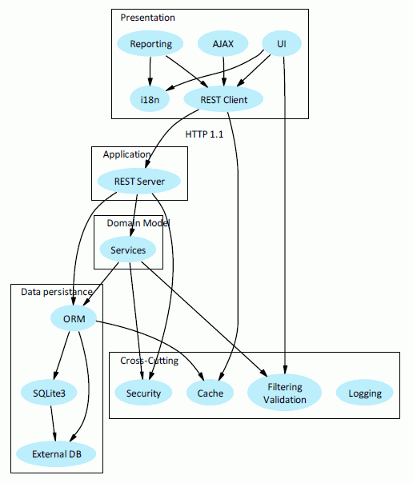

# The CHAOS library

A PHP library that helps you to build fully featured domain-driven applications.


## Install

``` bash
$ composer require chaos/common
```

## Contributing

Please see [CONTRIBUTING](CONTRIBUTING.md) for details.

## Credits

- [ntd1712](https://github.com/ntd1712)
